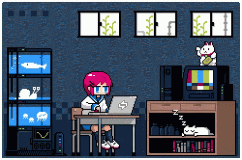

  

  
<h2 align="center">
  Hello world ✨ Eu sou a Lavinea Sens!
</h2>

 

  <a href="https://github.com/lalabq">
  
  

  

<!--
- 🔭 I’m currently working on ...
- 🌱 I’m currently learning ...
- 👯 I’m looking to collaborate on ...
- 🤔 I’m looking for help with ...
- 💬 Ask me about ...
- 📫 How to reach me: ...
- 😄 Pronouns: ...
- ⚡ Fun fact: ...
-->
